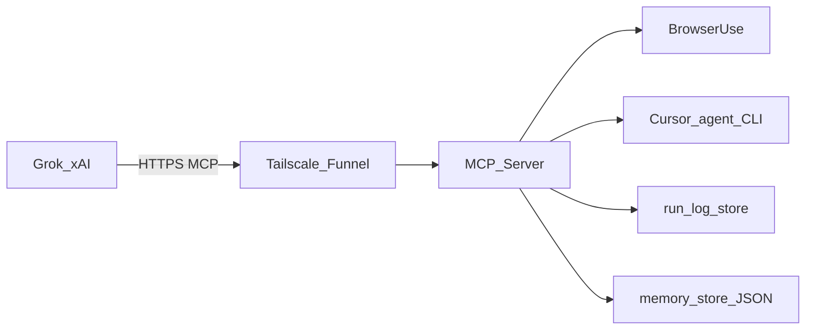

## Architecture (PC + Tailscale Funnel)

### Components

- **MCP server**: Python, **FastMCP** (official `mcp` PyPI package) + **Streamable HTTP** (stateless), mounted at **`/mcp/`** behind Starlette ([`main.py`](main.py)).
- **Auth**: ASGI **Bearer** middleware on the MCP mount only ([`auth_middleware.py`](auth_middleware.py)); **`/health`** stays unauthenticated.
- **Browser**: **Browser Use** drives **Playwright Chromium**; **DeepSeek** via OpenAI-compatible API ([`mcp_tools.py`](mcp_tools.py)). Default **headless**; per-domain **headed** preference in [`memory_store.py`](memory_store.py); optional **headed retry** on bot/login-like signals; optional **`BROWSER_USER_DATA_DIR`** for persistent cookies.
- **Cursor**: **Headless Cursor Agent CLI** (`agent --print`, `--trust`, `--workspace`) with **capability levels** (ask / plan / agent+force) in [`cursor_agent_tools.py`](cursor_agent_tools.py). **`--force`** only after operator **`approve_cursor_writes`** (stored in **`memory_store`**).
- **Optional tool lockout**: [`tool_gating.py`](tool_gating.py) reads **`MCP_DISABLED_TOOLS`**; **`get_status`** is exempt.
- **Internet ingress**: **[Tailscale Funnel](https://tailscale.com/docs/features/tailscale-funnel)** terminates TLS and forwards to **`http://127.0.0.1:<port>`**; the app should **not** listen on all interfaces in untrusted environments.

### Run logs (Grok debugging)

- Module **[`run_log.py`](run_log.py)** records **bounded**, **redacted** events per **`run_id`** for **`browser_task`** and **`cursor_agent`**.
- **`list_recent_runs`** / **`get_run_log`** MCP tools read from an in-memory ring buffer; optional **JSONL** append to **`AGENT_LOG_DIR`** when **`AGENT_LOG_ENABLE_DISK=true`**.
- Logs intentionally **exclude** model chain-of-thought; they focus on URLs, action class names, exit codes, and errors.

### Data flow

### Non-goals (current repo)

- No pixel-level remote control of the Cursor UI.
- No built-in credential vault; use **`allowed_tools`**, **`MCP_DISABLED_TOOLS`**, **`approve_cursor_writes`**, and operational discipline.

### Legacy

The codebase may still run on **Cloud Run** (`K_SERVICE`); that is not the primary documented deployment.
