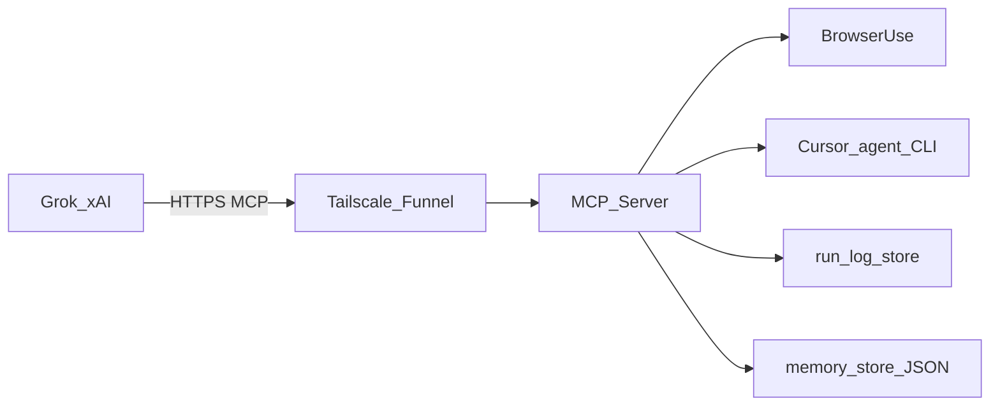

## Architecture (PC + Tailscale Funnel)

### Components

- **MCP server**: Python, **FastMCP** (official `mcp` PyPI package) + **Streamable HTTP** (stateless), mounted at **`/mcp/`** behind Starlette ([`main.py`](main.py)). FastMCP delegates to **`StreamableHTTPSessionManager`** + **`MCPServer`** in the same SDK.
- **Auth**: ASGI **Bearer** middleware on the MCP mount only ([`auth_middleware.py`](auth_middleware.py)); **`/health`** stays unauthenticated.
- **GitHub**: REST helpers in [`github_tools.py`](github_tools.py) (file read at **`ref`**, list paths, compare/diff, issue create) using **`GITHUB_TOKEN`**.
- **Browser**: **Browser Use** drives **Playwright Chromium**; **DeepSeek** via OpenAI-compatible API ([`mcp_tools.py`](mcp_tools.py)). **Shared browser hub** ([`browser_hub.py`](browser_hub.py)): one Chrome process (`keep_alive`); each **`browser_task`** opens a **new tab** (or **`continue_tab_id`** resumes an **idle** tab). Tabs stay open after the run for operator review. MCP tools **`list_browser_tabs`**, **`close_browser_tab`**, and **`browser_capture_tab_screenshot`** (fast CDP viewport PNG for a known **`tab_id`**); concurrency capped by **`BROWSER_TASK_MAX_CONCURRENT`**. Default **headless**; per-domain **headed** / **headless_ok** in [`memory_store.py`](memory_store.py); optional **headed retry** on bot/login-like signals; optional **`BROWSER_USER_DATA_DIR`** for persistent cookies.
- **Screenshots (Grok)**: When **`return_screenshot=true`** on **`browser_task`** and **`PUBLIC_MCP_BASE_URL`** is set (same Funnel origin as MCP), the tool returns a one-time **`screenshot_url`** (`GET /browser-screenshot/{token}` in [`main.py`](main.py)), via [`screenshot_serve.py`](screenshot_serve.py). Step history may be empty; then **`BrowserSession.take_screenshot()`** runs after the agent. **`browser_capture_tab_screenshot`** reuses the same URL registration for an existing tab without running the agent. Optional inline **`screenshot_base64`** via env.
- **Cursor**: **Headless Cursor Agent CLI** (`agent --print`, `--trust`, `--workspace`) with **capability levels** (ask / plan / agent+force) in [`cursor_agent_tools.py`](cursor_agent_tools.py). **`--force`** only after **`approve_cursor_writes`** or **`always_allow_level_3_rule`** (stored in **`memory_store`**).
- **Optional tool lockout**: [`tool_gating.py`](tool_gating.py) reads **`MCP_DISABLED_TOOLS`**; **`get_status`** is exempt.
- **Internet ingress**: **[Tailscale Funnel](https://tailscale.com/docs/features/tailscale-funnel)** terminates TLS and forwards to **`http://127.0.0.1:<port>`**; the app should **not** listen on all interfaces in untrusted environments. **`GET /health/live`** verifies the asyncio loop is still scheduling (detect process wedge).

### Run logs (Grok debugging)

- Module **[`run_log.py`](run_log.py)** records **bounded**, **redacted** events per **`run_id`** for **`browser_task`** and **`cursor_agent`**.
- **`list_recent_runs`** / **`get_run_log`** MCP tools read from an in-memory ring buffer; optional **JSONL** append to **`AGENT_LOG_DIR/agent_events.ndjson`** when **`AGENT_LOG_ENABLE_DISK=true`**.
- Logs intentionally **exclude** model chain-of-thought; they focus on URLs, action class names, exit codes, and errors.

### Data flow

### Non-goals (current repo)

- No pixel-level remote control of the Cursor UI.
- **Secrets**: do not put raw credentials in the **`browser_task`** **`task`** text (it is sent to the LLM). Use **encrypted local storage** ([`secrets_store.py`](secrets_store.py), MCP **`request_user_secret`** / **`list_secrets`** / **`revoke_secret`**, optional **`secret_prefill`**) plus **`allowed_tools`**, **`MCP_DISABLED_TOOLS`**, and **`approve_cursor_writes`** / **`always_allow_level_3_rule`** — not a managed cloud vault or HSM.

### Legacy

The codebase may still run on **Cloud Run** (`K_SERVICE`); that is not the primary documented deployment.
